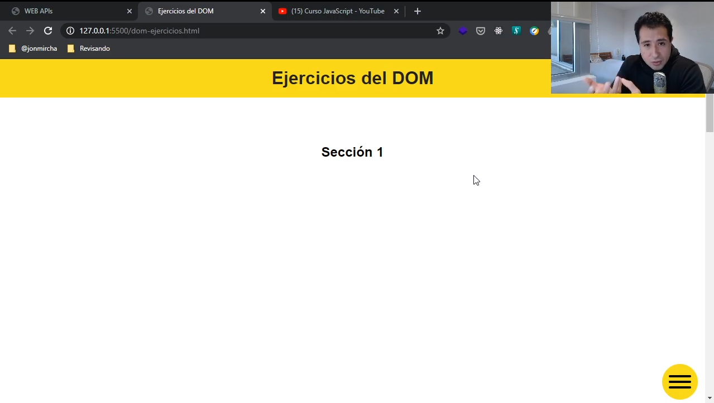
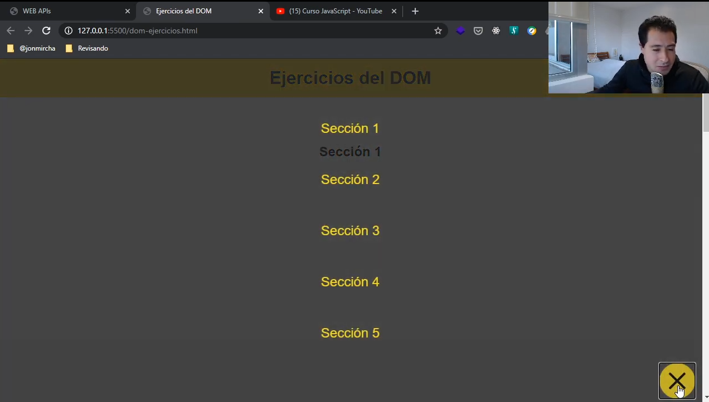

# Ejercicios del DOM

No importa que no te quede exactamente igual, lo importante es el manejo
que das a HTML usando JavaScript

Al darle click al menú de Hamburguesa aparece un menú, no importa donde
salga

Utilizar librería externa para ese botón

[Hamburguer CSS](https://jonsuh.com/hamburgers/)

Debe tener al menos 5 secciones y el menú debe llevarte a cada seccion
Todo el contenido en una sola página, ver lista de reproducción llamada
Tips CSS (Smooth Scrolling)

[SMOOTH SCROLLING con CSS - Desplazamiento suave | Ejemplo de uso](https://www.youtube.com/watch?v=skEawt_CV24)

Importante es que con JavaScript abras y cierres el menu de navegación
